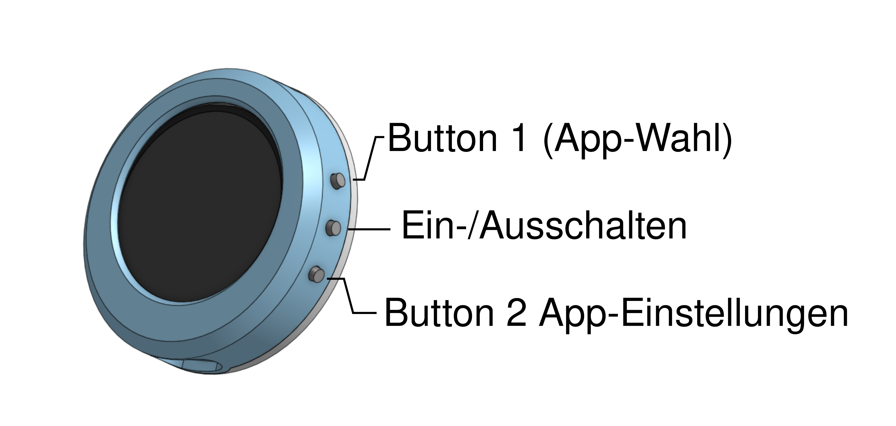
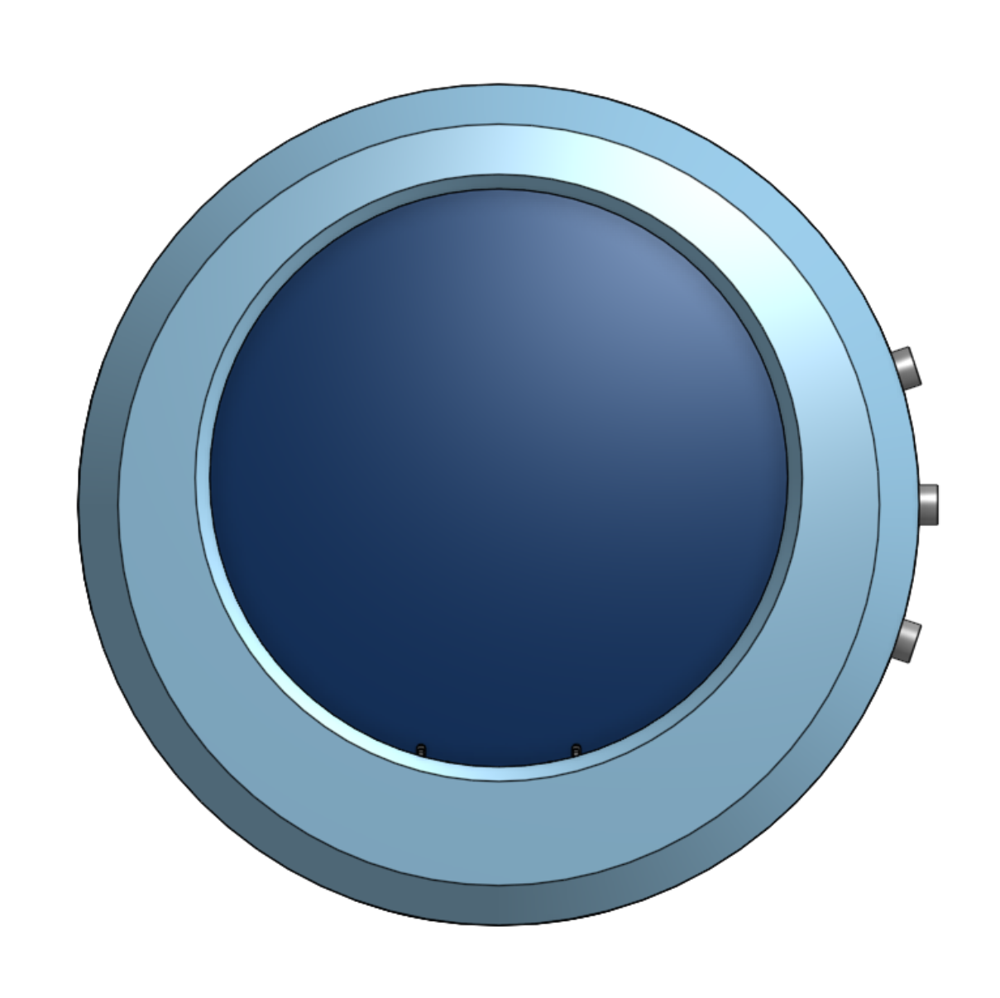
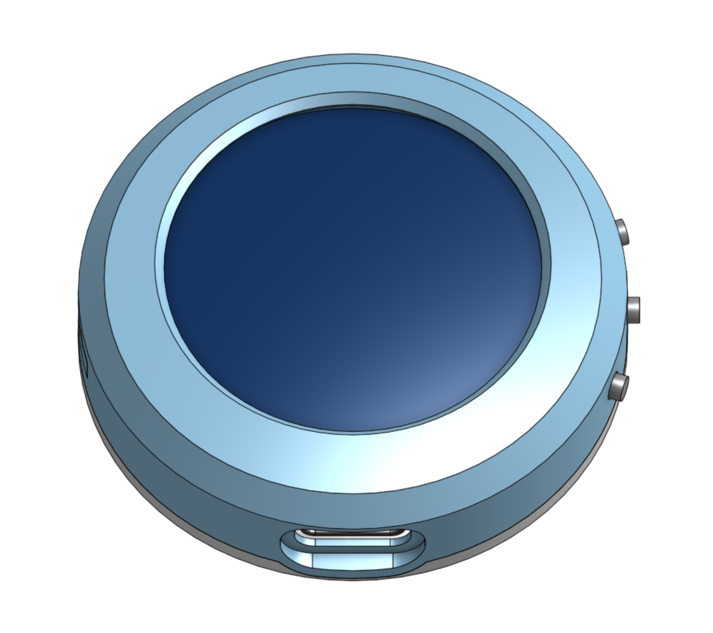
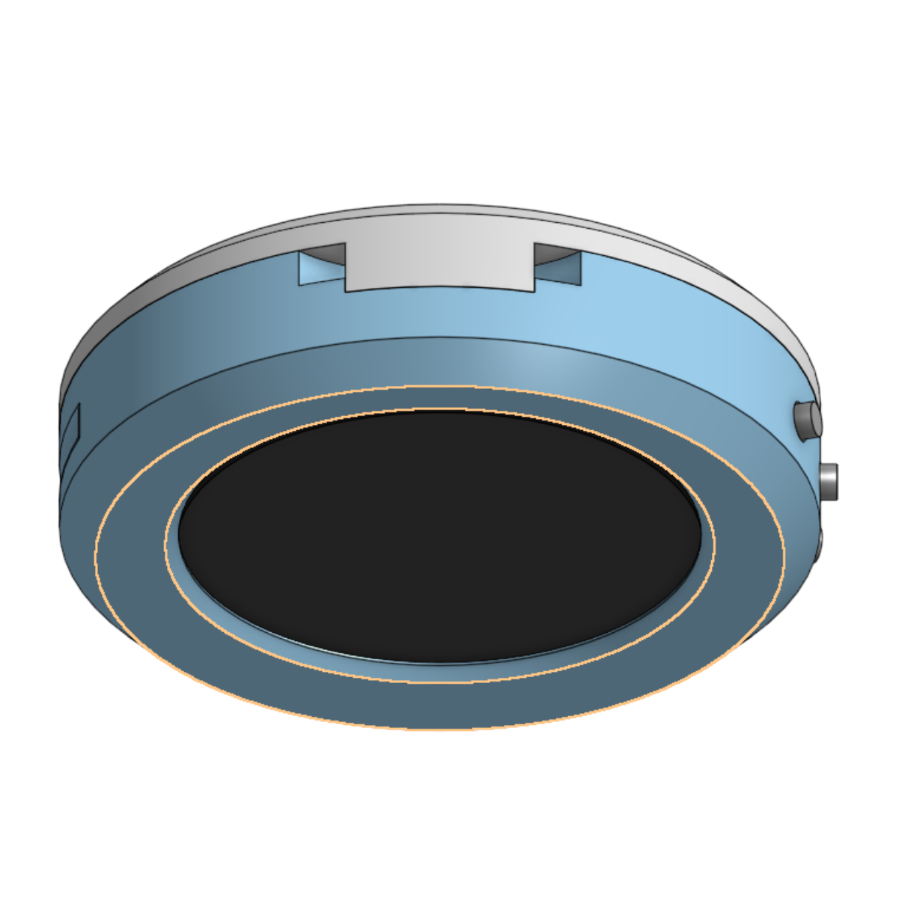

# ESP32 LCD-Brosche Board OS



Kompaktes Firmware-Projekt für eine tragbare LCD-Brosche: Ein ESP32-Devboard mit rundem GC9A01-TFT (240x240) und SD-Karte. Die Firmware stellt einen einfachen App-Manager bereit, der mehrere eigenständige Apps kapselt (z. B. eine Slideshow) und über zwei Hardware-Tasten gesteürt wird.

## Tools

- [Bildaufbereiter](https://teil3.github.io/LCD-Brosche-OS/tools/bildaufbereiter/)
<!--
- [GIF-Aufbereiter](https://teil3.github.io/LCD-Brosche-OS/tools/gifaufbereiter/)
-->
- [Text App Konfigurator](https://teil3.github.io/LCD-Brosche-OS/tools/textapp-konfigurator/)
- [Filesystem Browser](https://teil3.github.io/LCD-Brosche-OS/tools/filesystem-browser/)
- [QR-Code Generator](https://teil3.github.io/LCD-Brosche-OS/tools/qrcode/)
- [Lua Script Verwaltung](https://teil3.github.io/LCD-Brosche-OS/tools/lua-script-studio/)

### QR-Code Generator (Web-Tool)
- Pfad: `tools/qrcode/index.html` (in der Doku gehostet oder lokal per `python3 -m http.server` starten).
- Features: Textfeld (max. 387 Zeichen) mit Farbwählern, invert-Schalter, Zoom/Pan im Canvas und Maske der Brosche zur Vorschau.
- JPEG-Encoder läuft lokal über die vendorte `@jsquash/jpeg`-WASM-Builds – es ist keine Internetverbindung erforderlich, solange der Ordner `tools/bildaufbereiter/mozjpeg/` vorhanden ist.
- QR-Code-Generierung nutzt gebündelte `qrcode-generator@1.4.4`-Skripte (ebenfalls offline-tauglich). Sollte der lokale Import fehlschlagen, erfolgt ein CDN-Fallback.
- Ausgabe: Downloads, USB-WebSerial und BLE-Transfers erhalten ein Dateinamensschema `<letzte10Zeichen>-qr.jpg`. Ungültige Zeichen werden gefiltert, leere Eingaben resultieren in `qrcode-qr.jpg`.
- USB/BLE: Funktioniert nur über HTTPS oder `localhost`. Chromium-basierte Desktop-Browser sind Pflicht (WebSerial/WebBluetooth). Der Statusbereich zeigt, warum Buttons deaktiviert sind (z. B. kein Secure Context).
- Workflow zum lokalen Testen:
  ```bash
  cd tools/qrcode
  python3 -m http.server 8080
  # Im Browser https://localhost:8080 oder http://127.0.0.1:8080 aufrufen
  ```
  Beim Einsatz über `file://` werden MozJPEG und QR-Library automatisch via CDN geladen – Upload/Senden funktioniert allerdings nur über sichere Origins.

### Buttonbelegung
- BTN1: Single -> nächste App, Double -> vorherige App
- BTN2: (Moduswechsel mit Long-Press): Auto -> Manuell -> Setup -> Auto
  - Auto/Manuell: Single -> nächster Slide, Double -> Verweildauer zyklisch, Triple -> Dateiname an/aus
  - Setup-Modus (Flash/SD):
    - Single -> Quelle umschalten (SD <-> Flash)
    - Double -> Kopier-Dialog "Alles kopieren?" (Single wechselt Auswahl, Long bestätigt)
    - Long  -> zurück zum nächsten Modus (Auto)
    - Wärend des Kopierens: Long -> Abbrechen (Fortschrittsanzeige erscheint)
    
## Hardware
- ESP32 (D0WD-V3 oder kompatibel)
- GC9A01-basierte 1.28"-TFT-Anzeige
- Micro-SD-Kartenslot
- Zwei Taster (BTN1=GPIO32, BTN2=GPIO33 oder GPIO35 ohne internen Pull-up)
- Pins laut `Config.h` (nicht ändern, ohne Rücksprache):<br>`SCK=14`, `MOSI=15`, `MISO=2`, `SD_CS=13`, `TFT_CS=5`, `TFT_BL=22`
- Schmuck-tauglicher Formfaktor als Brosche mit Anhängepunkt

## Projektaufbau
- `ESP32-BoardOS.ino` - Einstiegspunkt, Hardware-Setup, App-Registrierung
- `Config.h` - Pinout, Timings, globale Konstanten
- `Core/` - App-Basis, AppManager, Button-Handling, Grafik-Utilities, Bootlogo
- `Apps/` - App-Implementierungen wie `SlideshowApp`
- Neue LuaApp ermöglicht Skript-gesteuerte Animationen.
- `assets/` - Beispielinhalte für die SD-Karte (Bilder, Medien, ...)
- `docs/` - Hardwarefotos und ein Datenblatt als Referenz
- `partitions.csv` - Benutzerdefinierte Partitions-Tabelle (16 MB Flash, 8 MB LittleFS)

## Voraussetzungen
- Arduino CLI >= 0.35
- ESP32 Core >= 3.2.0 (`esp32:esp32`)
- Bibliotheken: `TFT_eSPI 2.5.43`, `TJpg_Decoder 1.1.0`

```bash
arduino-cli core update-index
arduino-cli core install esp32:esp32
arduino-cli lib install "TFT_eSPI" "TJpg_Decoder"
```

## Kompilieren & Flashen
```bash
arduino-cli compile -b esp32:esp32:esp32 \
  --build-property build.flash_size=16MB \
  --build-property build.partitions=partitions.csv \
  --build-property compiler.cpp.extra_flags="-DSMOOTH_FONT" \
  --build-property compiler.c.extra_flags="-DSMOOTH_FONT" \
  --build-path build-16m .
arduino-cli compile -b esp32:esp32:esp32 \
  --build-property compiler.cpp.extra_flags="-DSMOOTH_FONT" \
  --build-property compiler.c.extra_flags="-DSMOOTH_FONT" .
arduino-cli upload  -b esp32:esp32:esp32 --input-dir build-16m -p /dev/ttyACM0
arduino-cli monitor -p /dev/ttyACM0 -c baudrate=115200
```

### Flash komplett löschen (bei Problemen)
Falls das Board in einem Crash-Loop hängt oder korrupte Dateien im LittleFS vorhanden sind, hilft ein vollständiges Löschen des Flash-Speichers:

```bash
python3 -m esptool --chip esp32 --port /dev/ttyACM0 erase_flash
```

**Wichtig:** Nach dem Löschen muss die Firmware neu geflasht werden. Beim ersten Boot nach dem Erase wird das LittleFS automatisch formatiert und initialisiert.

> Hinweis: Die Datei `partitions.csv` im Projektwurzelverzeichnis definiert die 8 MB grosse
> LittleFS-Partition. Führe vor dem Upload unbedingt die erste `arduino-cli compile`-Zeile
> aus, damit Partitionstabelle und Bootloader auf 16 MB Flash abgestimmt sind. Der direkte
> Upload-Befehl übernimmt dann das zuletzt erzeugte Build-Artefakt. Die zweite Compile-Zeile
> dient nur als Fallback für Boards mit 4 MB Standardlayout.

## Flash-Speicher & Offline-Modus
- LittleFS wird beim Start automatisch gemountet und bei Bedarf formatiert (erste Nutzung).
- Im Flash liegt der Ordner `/slides`, der durch den Kopiervorgang aus der Slideshow-App
  befüllt wird.
- Bilder lassen sich offline anzeigen, sobald sie von der SD-Karte in den Flash kopiert wurden.
- JPEGs sollten bereits am Rechner auf 204x240 Pixel verkleinert und als non-progressive
  gespeichert werden (z. B. per Web-Tool oder Skript), damit die ESP32-Dekodierung sicher klappt.

## Laufzeitverhalten
- SD-Karte vor dem TFT initialisieren; beide CS-Leitungen vor `begin()` auf HIGH legen.
- JPEG-Ausgabe nutzt `TJpgDec.setSwapBytes(true)`.
- Keine langen `delay()`-Aufrufe in App-Logik, um Buttons responsiv zu halten.
- Statusmeldungen (Toast/Overlay) immer via `TextRenderer::drawCentered()` + Outline zeichnen und mit `pauseUntil()` ungefähr 1 s sichtbar lassen.


## Offline-Slideshow (Flash)
- Schritt-für-Schritt (SD -> Flash):
  1. BTN2 lang drücken, bis der schwarze Setup-Bildschirm mit "Setup" und der aktuellen Quelle erscheint (Moduswechsel Auto -> Manual -> Setup).
  2. BTN2 doppelt drücken: Der Dialog "Alles kopieren?" erscheint.
  3. Mit BTN2 kurz zwischen "Nein" und "Ja" wechseln (Pfeil markiert die Auswahl), BTN2 lang bestätigt die markierte Option.
  4. BTN2 lang während des laufenden Kopierens -> Abbrechen (bereits kopierte Dateien bleiben erhalten).
  5. Nach Abschluss schaltet die App automatisch auf Flash als Quelle um (Setup-Overlay zeigt "Quelle: Flash").
- Quelle manuell wechseln (SD <-> Flash): Im Setup-Modus BTN2 einmal kurz drücken.
- Falls keine Bilder existieren, erscheint ein Hinweis Toast; in diesem Fall bleiben Quelle und Modus unverändert.

## Slideshow-App
- Lädt JPEG-Dateien von der SD-Karte (Standardverzeichnis `/`).
- Auto-Modus mit verschiedenen Verweildauern (1 s bis 5 min), umschaltbar per BTN2 Double.
- Optionaler Dateiname im Overlay; ein- oder ausblendbar mit BTN2 Triple.
- Nutzt Toast-Overlays, um Moduswechsel sichtbar zu machen.
- Medien müssen im JPEG-Format mit korrekter SOI-Signatur (`0xFF 0xD8`) vorliegen.

### Bildaufbereiter (Web-Tool)
- Online-Tool zum Zuschneiden (240×240), Encoden und Übertragen von Bildern:
  [https://teil3.github.io/LCD-Brosche-OS/tools/bildaufbereiter/](https://teil3.github.io/LCD-Brosche-OS/tools/bildaufbereiter/)
- Unterstützt Download als JPEG, Bluetooth-LE-Transfer sowie USB-WebSerial (921600 Baud).
- Funktioniert in Chromium-basierten Desktop-Browsern (HTTPS oder `localhost` erforderlich).
- USB-Senden: Browser fragt nach dem USB-Port, überträgt das JPEG in 1 KB-Blöcken, zeigt den Fortschritt an und schickt das Bild direkt in den Flash der Brosche.

## LittleFS-Tools
- `tools/upload_system_image.py /dev/ttyACM0 <datei> [/ziel]` – Überträgt Dateien nach LittleFS (Standard `/system`).
- `tools/list_littlefs.py --port /dev/ttyACM0 --root /system/fonts` – Listet rekursiv Inhalte und zeigt gleichzeitig mit `FSINFO` Total/Used/Free in KB an.
- Serielle Kommandos (USB-Transfer-Modus aktivieren, 115200 Bd):
  - `PING` → `USB OK PONG`
  - `LIST /system/fonts` → `USB OK LIST …` sowie `USB OK LISTDONE`
  - `FSINFO` → `USB OK FSINFO <total> <used> <free>` (Bytes)

## TextApp (SmoothFont)
- Nutzt ausschliesslich SmoothFonts (`*.vlw`), die auf LittleFS unter `/system/fonts/` liegen.
- Konfiguration via `/textapp.cfg` (Upload nach LittleFS). Wichtige Schlüssel:
  - `TEXT=Zeile 1|Zeile 2|…` → `|` erzeugt Zeilenumbrüche.
  - `FONT=FreeSansBold18pt` → Basisname ohne `.vlw` (Upload wandelt nach Kleinbuchstaben, z. B. `/system/fonts/freesansbold18pt.vlw`).
  - `ALIGN=left|center|right` → Startausrichtung (optional, Standard `center`).
  - `MODE=text|big_words|big_letters` → Initialer Modus (Standard `text`).
- Steuerung (BTN2, während die TextApp aktiv ist):
  - Single: Moduswechsel (Textblock → BigWords → BigLetters → …)
  - Double: Geschwindigkeit für BigWords/BigLetters (200/500/1000/2000/3000 ms)
  - Long: Im Textblock-Modus Ausrichtung zyklisch (links → zentriert → rechts)
- Textblock-Modus zeichnet den Absatz komplett in ein Sprite, skaliert ihn proportional, zentriert ihn vertikal und wendet die gewählte Ausrichtung an. BigWords/BigLetters skalieren SmoothFonts ebenfalls proportional (~80 % Breite bzw. ~70 % Höhe).
- Fallback: Fehlt der SmoothFont, erscheint eine Statusmeldung und es wird die interne pixelige Schrift genutzt.

### Fonts hochladen
```bash
python3 tools/upload_system_image.py /dev/ttyACM0 assets/fonts/FreeSansBold18pt.vlw /system/fonts
python3 tools/upload_system_image.py /dev/ttyACM0 assets/fonts/FreeSansBold24pt.vlw /system/fonts
python3 tools/upload_system_image.py /dev/ttyACM0 assets/fonts/FreeSerif18pt.vlw /system/fonts
```
Prüfen, ob die Fonts vorhanden sind und wie viel Speicher noch frei ist:
```bash
python3 tools/list_littlefs.py --port /dev/ttyACM0 --root /system/fonts
```
Die Ausgabe enthält neben der Dateiliste auch `LittleFS: total/used/free` in KB (nutzt das neue `FSINFO`-Kommando).

## LuaApp (experimentell)
- Führt Lua 5.4 Skripte direkt auf der Brosche aus. Die App sucht beim Start `/scripts/main.lua` auf LittleFS – falls kein Skript vorhanden ist, läuft ein eingebautes Demo.
- Unterstützte Standardbibliotheken: `base`, `table`, `string`, `math`, `utf8`. Zudem gibt es das globale Modul `brosche` mit folgenden Funktionen (Stand November 2025):
  - Zeichenfunktionen: `fill`, `clear`, `rect`, `line`, `circle`, `fillCircle`, `triangle`, `fillTriangle`, `text`, `rgb`
  - Logging & Zeit: `log(...)`, `time()` (Millis seit Boot)
  - Fonts: `loadFont(path)`, `unloadFont()` – Pfade innerhalb `/system/font.vlw` oder `/system/fonts/*.vlw`
  - Sensorik: `temperature()` liefert den ungekalibrierten internen ESP32-Sensor in °C (nur grobe Trends!)
  - Dateisystem (whitelistet `/scripts`, `/slides`, `/system/fonts`): `readFile(path)`, `writeFile(path, data)`, `listFiles(dir)`
  - Weitere Hilfen: `rgb(r,g,b)` konvertiert 0–255-Werte in 16 Bit Farben
- Das Skript darf optional die Funktionen `setup()`, `loop(dt)` und `onButton(btn, event)` definieren. `loop` erhält das Delta in Millisekunden, `btn` ist 1 oder 2, `event` ist `"single"|"double"|"triple"|"long"`.
- Beispielskript (`assets/scripts/main.lua`):
  ```lua
  local angle = 0
  function setup()
    brosche.clear()
    brosche.log('Lua main.lua gestartet')
  end

  function loop(dt)
    angle = (angle + dt / 20) % 360
    local r = math.floor((math.sin(math.rad(angle)) * 0.5 + 0.5) * 255)
    local g = math.floor((math.sin(math.rad(angle + 120)) * 0.5 + 0.5) * 255)
    local b = math.floor((math.sin(math.rad(angle + 240)) * 0.5 + 0.5) * 255)
    brosche.fill(brosche.rgb(r, g, b))
    brosche.text(120, 120, string.format('%.0f', angle), brosche.rgb(0, 0, 0))
  end

  function onButton(btn, event)
    brosche.log(string.format('BTN%d %s', btn, event))
  end
  ```
- Skripte lassen sich wie gewohnt via `tools/filesystem-browser` oder `tools/upload_system_image.py` nach `/scripts` kopieren. Beispiel:
  ```bash
  python3 tools/upload_system_image.py /dev/ttyACM0 assets/scripts/main.lua /scripts
  ```
- Zusätzliche Beispiele:
  - `assets/scripts/time_shapes.lua` – zeigt neue Zeichenfunktionen, `brosche.time()` und File-I/O (Logdatei).
  - `assets/scripts/api_showcase.lua` – kompakte Übersicht über Shapes, Dateizugriff, Temperatur und Buttons.
- Die App scannt `/scripts` automatisch. BTN2 Single springt zum nächsten `.lua`, BTN2 Long zum vorherigen. Aktuell wird beim Umschalten kurz der neue Dateiname eingeblendet, das Skript startet jedoch teilweise noch einmal bei `main.lua` – daran arbeiten wir (bekanntes Issue).
- Achtung: Lua verwendet denselben Heap wie die Firmware. Halte Skripte kompakt (ein Thread, keine großen Tabellen), sonst drohen `Lua: kein Speicher` Fehlermeldungen.

## Dokumentation
- [Datenblatt (DE)](<docs/ESP32-1,28-Rund-TFT-Display-Board V1.12.pdf>) - Boarddatenblatt und Anschlussplan
- [User Manual (EN)](<docs/1.28ESP32-Round-TFT-Board_User-Manual_V1.12_EN.pdf>) - Englische Referenz zum Basismodul
- [Blockdiagramm](<docs/PrincipleBlockDiagram V1.11.pdf>) - Übersichtliche Darstellung von Signalflüsse und Komponenten

### Hardwaregalerie





## Mitwirken & Nächste Schritte
- Weitere Apps können als `Apps/<Name>App.h/.cpp` hinzugefügt und in `ESP32-BoardOS.ino` registriert werden.
- Dokumentation ausbauen: Hardwareaufbau, Stromversorgung, bekannte Issues, FAQ.
- Tests oder Checks ergänzen (z. B. automatische SD-Content-Prüfung, Unit-Tests für Button-Events).
