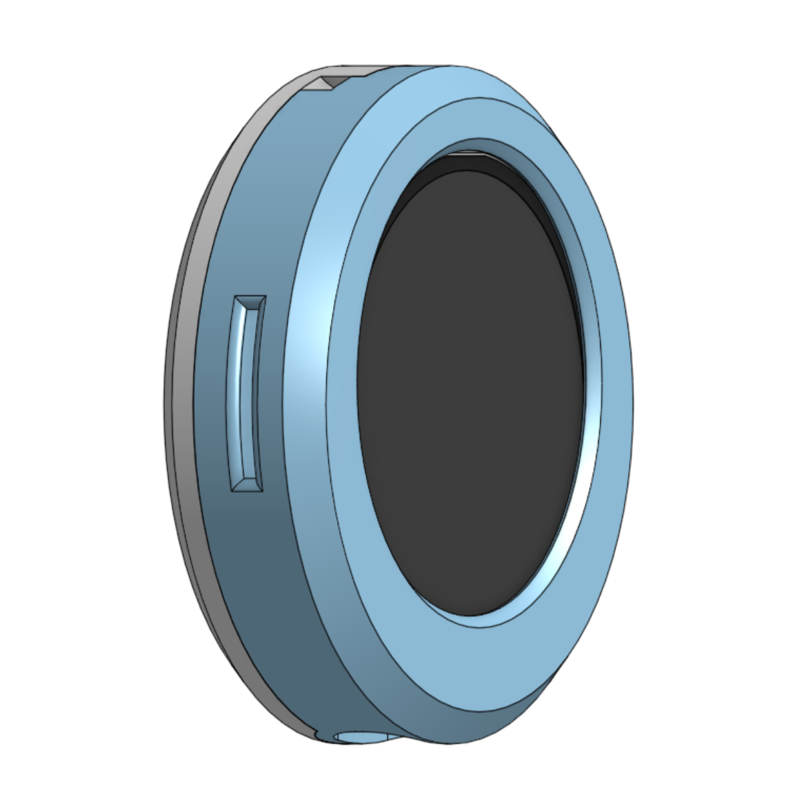

# ESP32 LCD-Brosche Board OS


Kompaktes Firmware-Projekt fuer eine tragbare LCD-Brosche: Ein schmuckartiges ESP32-Devboard mit rundem GC9A01-TFT (240x240) und SD-Karte. Die Firmware stellt einen einfachen App-Manager bereit, der mehrere eigenstaendige Apps kapselt (z. B. eine Slideshow) und ueber zwei Hardware-Tasten gesteuert wird.

## Hardware
- ESP32 (D0WD-V3 oder kompatibel)
- GC9A01-basierte 1.28"-TFT-Anzeige
- Micro-SD-Kartenslot
- Zwei Taster (BTN1=GPIO32, BTN2=GPIO33 oder GPIO35 ohne internen Pull-up)
- Pins laut `Config.h` (nicht aendern, ohne Ruecksprache):<br>`SCK=14`, `MOSI=15`, `MISO=2`, `SD_CS=13`, `TFT_CS=5`, `TFT_BL=22`
- Schmuck-tauglicher Formfaktor als Brosche mit Anhaengepunkt

## Projektaufbau
- `ESP32-BoardOS.ino` - Einstiegspunkt, Hardware-Setup, App-Registrierung
- `Config.h` - Pinout, Timings, globale Konstanten
- `Core/` - App-Basis, AppManager, Button-Handling, Grafik-Utilities, Bootlogo
- `Apps/` - App-Implementierungen wie `SlideshowApp`
- `assets/` - Beispielinhalte fuer die SD-Karte (Bilder, Medien, ...)
- `docs/` - Hardwarefotos und ein Datenblatt als Referenz
- `partitions/` - Benutzerdefinierte Partitionstabelle mit grosser LittleFS-Partition

## Voraussetzungen
- Arduino CLI >= 0.35
- ESP32 Core >= 3.2.0 (`esp32:esp32`)
- Bibliotheken: `TFT_eSPI 2.5.43`, `TJpg_Decoder 1.1.0`

```bash
arduino-cli core update-index
arduino-cli core install esp32:esp32
arduino-cli lib install "TFT_eSPI" "TJpg_Decoder"
```

## Kompilieren & Flashen
```bash
arduino-cli compile -b esp32:esp32:esp32 \
  --build-property build.partitions=custom_16mb_lfs .
arduino-cli upload  -b esp32:esp32:esp32 -p /dev/ttyUSB0
arduino-cli monitor -p /dev/ttyUSB0 -c baudrate=115200
```

> Hinweis: `custom_16mb_lfs.csv` (in `partitions/`) legt eine 8 MB grosse LittleFS-Partition
> an. Das Firmware-Image muss immer mit dieser Partitionstabelle gebaut werden, damit der
> interne Slidespeicher funktioniert.

## Flash-Speicher & Offline-Modus
- LittleFS wird beim Start automatisch gemountet und bei Bedarf formatiert (erste Nutzung).
- Im Flash liegt der Ordner `/slides`, der durch den Kopiervorgang aus der Slideshow-App
  befuellt wird.
- Bilder lassen sich offline anzeigen, sobald sie von der SD-Karte in den Flash kopiert wurden.
- JPEGs sollten bereits am Rechner auf 204x240 Pixel verkleinert und als non-progressive
  gespeichert werden (z. B. per Web-Tool oder Skript), damit die ESP32-Dekodierung sicher klappt.

## Laufzeitverhalten
- SD-Karte vor dem TFT initialisieren; beide CS-Leitungen vor `begin()` auf HIGH legen.
- JPEG-Ausgabe nutzt `TJpgDec.setSwapBytes(true)`.
- Keine langen `delay()`-Aufrufe in App-Logik, um Buttons responsiv zu halten.
- Statusmeldungen (Toast/Overlay) immer via `TinyFont::drawStringOutlineCentered()` zeichnen und mit `pauseUntil()` ungefaehr 1 s sichtbar lassen.

### Buttonbelegung
- BTN1: Single -> naechste App, Double -> vorherige App, Long -> Backlight Toggle
- BTN2 (Moduswechsel mit Long-Press): Auto -> Manuell -> Setup -> Auto
  - Auto/Manuell: Single -> naechster Slide, Double -> Verweildauer zyklisch, Triple -> Dateiname an/aus
  - Setup-Modus (Flash/SD):
    - Single -> Quelle umschalten (SD <-> Flash)
    - Double -> Kopier-Dialog "Alles kopieren?" (Single wechselt Auswahl, Long bestaetigt)
    - Long  -> zurueck zum naechsten Modus (Auto)
    - Waerend des Kopierens: Long -> Abbrechen (Fortschrittsanzeige erscheint)

## Offline-Slideshow (Flash)
- Schritt-fuer-Schritt (SD -> Flash):
  1. BTN2 lang druecken, bis der schwarze Setup-Bildschirm mit "Setup" und der aktuellen Quelle erscheint (Moduswechsel Auto -> Manual -> Setup).
  2. BTN2 doppelt druecken: Der Dialog "Alles kopieren?" erscheint.
  3. Mit BTN2 kurz zwischen "Nein" und "Ja" wechseln (Pfeil markiert die Auswahl), BTN2 lang bestaetigt die markierte Option.
  4. BTN2 lang waehrend des laufenden Kopierens -> Abbrechen (bereits kopierte Dateien bleiben erhalten).
  5. Nach Abschluss schaltet die App automatisch auf Flash als Quelle um (Setup-Overlay zeigt "Quelle: Flash").
- Quelle manuell wechseln (SD <-> Flash): Im Setup-Modus BTN2 einmal kurz druecken.
- Falls keine Bilder existieren, erscheint ein Hinweis Toast; in diesem Fall bleiben Quelle und Modus unveraendert.

## Slideshow-App
- Laedt JPEG-Dateien von der SD-Karte (Standardverzeichnis `/`).
- Auto-Modus mit verschiedenen Verweildauern (1 s bis 5 min), umschaltbar per BTN2 Double.
- Optionaler Dateiname im Overlay; ein- oder ausblendbar mit BTN2 Triple.
- Nutzt Toast-Overlays, um Moduswechsel sichtbar zu machen.
- Medien muessen im JPEG-Format mit korrekter SOI-Signatur (`0xFF 0xD8`) vorliegen.

## Dokumentation
- [`docs/ESP32-1,28-Rund-TFT-Display-Board V1.12.pdf`](<docs/ESP32-1,28-Rund-TFT-Display-Board V1.12.pdf>) - Boarddatenblatt und Anschlussplan
- [`docs/1.28ESP32-Round-TFT-Board_User-Manual_V1.12_EN.pdf`](<docs/1.28ESP32-Round-TFT-Board_User-Manual_V1.12_EN.pdf>) - Englische Referenz zum Basismodul

### Hardwaregalerie




## Mitwirken & Naechste Schritte
- Weitere Apps koennen als `Apps/<Name>App.h/.cpp` hinzugefuegt und in `ESP32-BoardOS.ino` registriert werden.
- Dokumentation ausbauen: Hardwareaufbau, Stromversorgung, bekannte Issues, FAQ.
- Tests oder Checks ergaenzen (z. B. automatische SD-Content-Pruefung, Unit-Tests fuer Button-Events).
